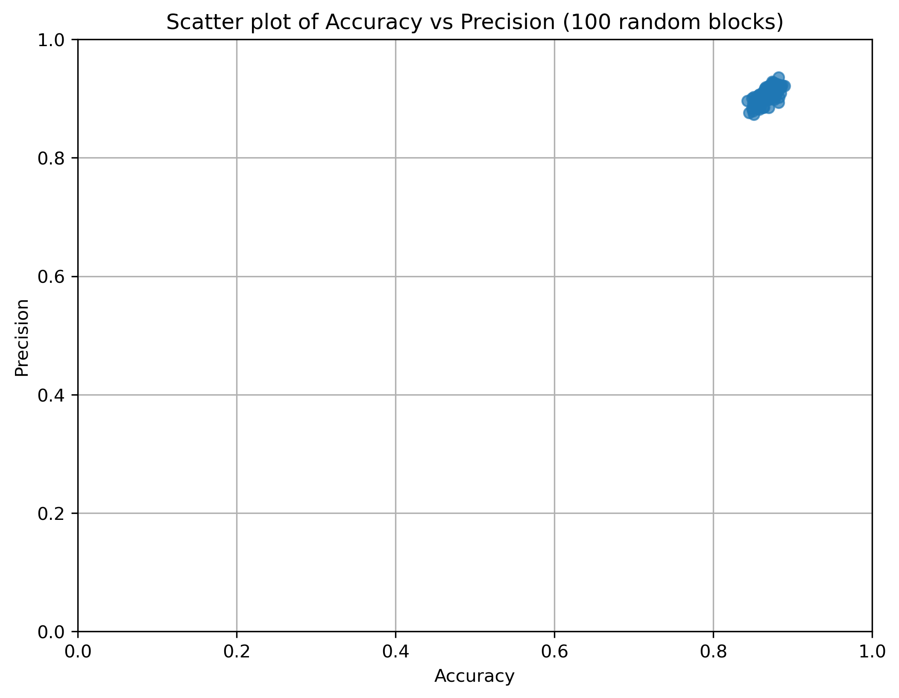

# 🧪 EDA para Clasificación de Productos: Nuevo vs Usado

> **Propósito:** Este análisis busca desarrollar una estrategia clara y accionable para clasificar productos como **nuevos** o **usados**, usando reglas interpretables derivadas del análisis exploratorio de datos (EDA).

---

## 🔍 1. Contexto y Decisión Inicial

Ante la problemática planteada, se proporcionó un contexto inicial junto con un script que dividía el dataset en `train-test`. Sin embargo, esta estrategia no se alineaba con el enfoque adoptado en este desarrollo.  

En lugar de entrenar un modelo predictivo desde el inicio, se priorizó **comprender a fondo el comportamiento de los datos**. El objetivo fue generar lógica de negocio clara, interpretable y directamente aplicable, sin depender de modelos complejos ni infraestructura adicional.

> *Aquí el EDA no es un paso previo: es la solución misma.*

La lógica resultante debe ser interpretable, auditable, y ejecutable sin necesidad de modelos externos, frameworks complejos ni infraestructura especializada.

### ❗¿Por qué no se usó una separación `train-test` o un modelado complejo?

La respuesta corta: **el tiempo es limitado y la simplicidad manda**… siempre que sea suficiente para cumplir los objetivos.

Pero más allá del pragmatismo, la elección también se fundamenta en una decisión técnica madura: este proyecto busca **entender los datos y derivar reglas claras, interpretables y listas para producción**, sin depender de infraestructura adicional ni pipelines de entrenamiento.

Más adelante en este documento se explora en detalle por qué esta fue la mejor decisión para el contexto actual.

---

## 🛠️ 2. Procesamiento y Selección de Variables

Antes de aplicar cualquier transformación, se estableció un supuesto fundamental:  
🔹 **El sistema debe ser capaz de categorizar un producto como nuevo o usado en el momento exacto en que es publicado**, sin acceso a información futura o a datos que requieran procesamiento complejo o asincrónico.

Este enfoque excluye explícitamente variables que solo están disponibles después de la publicación (como `sold_quantity` o `stop_time`) o que requieren esfuerzo computacional no justificable para un MVP basado en reglas.

Adicionalmente, se priorizaron atributos:
- Que sean fácilmente accesibles desde el JSON de entrada original
- Que reflejen información visible al usuario o al sistema al momento de la creación
- Que puedan ser interpretados sin ambigüedad por un sistema de reglas

Con estos principios en mente, se realizó un análisis detallado variable por variable. A continuación se presenta un resumen representativo:

> ⚠️ Esta tabla no resume todas las variables procesadas, sino una selección representativa de los distintos casos encontrados. Para ver el tratamiento completo, consultar el archivo [`data_converter.py`](./data_converter.py).

| Categoría | Acción Tomada | Ejemplo | Justificación |
|----------|----------------|---------|---------------|
| `warranty`, `video_id`, `official_store_id` | Convertidas a booleanas por presencia (`True/False`) | Si `warranty = "6 meses"` → `True`; si `NaN` → `False` | La sola existencia de estos atributos ya es informativa. Su valor específico es altamente variable y difícil de estandarizar, mientras que su ausencia puede reflejar un producto genérico o no institucional. |
| `sub_status`, `tags` | Retenidas como categóricas para futura dummificación | Si `sub_status = "suspended"` → `sub_status_suspended = 1` | Estas variables contienen múltiples categorías con valor semántico claro (como "suspended", "expired", "deleted"). Convertirlas a variables dummy permite capturar ese significado sin perder interpretabilidad. |
| `local_pickup`, `free_shipping`, `has_dimensions`, `accepts_mercadopago` | Convertidas a booleanas | Si `free_shipping = True`, se conserva; si `False` o `NaN`, se transforma en `False` | Estas variables provienen del diccionario `shipping`, y representan características logísticas y de pago visibles al momento de publicar. Al ser estables y fácilmente interpretables, se prestan bien para la generación de reglas. |
| `seller_address`,`permalink`, `id` | Eliminadas por ser irrelevantes, identificadores o no estructuradas | `seller_address["state"]["name"]` → eliminado | Estas variables no aportan valor predictivo directo. Algunas son identificadores únicos, otras son constantes o requieren procesamiento avanzado (como imágenes), lo cual va en contra del principio de simplicidad del enfoque. |
| `start_time`, `stop_time`, `created_time`, `sold_quantity`, `available_quantity` | Eliminadas por no estar disponibles | `sold_quantity = 45` → eliminado | Estas variables no estarán disponibles **al momento de la creación de una nueva publicación**, que como se menciona antes de esta tabla, es el contexto específico de este análisis. Por tanto, su uso no es válido en este escenario. |

> 📝 Las transformaciones fueron diseñadas pensando en su aplicabilidad en producción y facilidad de mantenimiento. Se evitaron decisiones basadas en correlación superficial, priorizando aquellas con un respaldo conceptual claro y un impacto explicable en la predicción.

---

## 📊 3. Análisis Exploratorio

Una vez que los datos fueron limpiados, transformados y filtrados, se procedió al análisis gráfico para identificar **patrones de comportamiento relevantes respecto a la condición del artículo** (nuevo vs usado).

El criterio principal utilizado fue la **diferencia relativa entre clases**, no la frecuencia absoluta.

Por ejemplo:

- Si el 90 % de los productos con `free_shipping = True` son nuevos, mientras que solo el 40 % de los que no ofrecen envío gratuito lo son, esta variable revela un patrón estructural claro.

> 🧠 **Enfoque analítico:** Se priorizaron variables que mostraran diferencias proporcionales significativas entre clases, sin importar cuán frecuentes fueran en términos absolutos. Lo que buscamos son señales estructurales, no efectos de volumen.

---

## 🧾 4. Evaluación de Texto

Se evaluó el uso del campo `title` mediante técnicas de procesamiento de lenguaje natural (NLP), incluyendo modelos de última generación.

Particularmente, se probaron **transformers preentrenados** como `facebook/bart-large-mnli` para clasificación cero-shot (zero-shot classification). Sin embargo, esta aproximación fue descartada por varios motivos:

- ⏱️ **Tiempos de inferencia elevados**, incompatibles con pipelines ligeros y orientados a producción rápida  
- 📉 **Rendimiento limitado**: los resultados obtenidos con títulos reales fueron poco consistentes, incluso tras aplicar limpieza básica  
- 🧠 **Complejidad técnica elevada**, que no se justificaba frente al bajo retorno observado

> En un contexto donde se busca un MVP robusto, interpretable y fácilmente desplegable, se decidió priorizar el uso de variables estructuradas, con comportamiento más estable y trazabilidad directa.

---

## 🌲 5. Árbol de Decisión como Herramienta de Reglas

Se utilizó un modelo de tipo árbol como herramienta de **EDA asistido**, no como modelo predictivo final. En particular, se empleó `XGBoost` configurado para generar árboles interpretables, manteniendo así la **legibilidad estructural** y permitiendo extraer lógica clara.

> 🔍 **Esto NO es un modelo productivo. Es una herramienta para descubrir reglas lógicas robustas y comprensibles, directamente traducibles a código de negocio.**

### ⚙️ Consideraciones Técnicas

- Se limitó la profundidad de los árboles (`max_depth`) para evitar reglas complejas y garantizar su trazabilidad.  
- La estructura de árbol facilita la lectura y análisis de decisiones jerárquicas, haciendo más evidente cómo ciertas combinaciones de variables llevan a una predicción.  
- No se buscó maximizar la métrica de `accuracy_score`, sino **identificar condiciones estructurales sólidas y con alta `precision_score`**, que puedan aplicarse en producción sin ambigüedad.

### ✅ Ventajas del Enfoque

- 🧠 **Alta interpretabilidad**: cada ruta del árbol representa una secuencia clara de decisiones.  
- 🧪 **Validación por expertos no técnicos**: las reglas pueden ser evaluadas por equipos de negocio sin requerir conocimiento de modelos.  
- 🔁 **Reutilización directa**: las condiciones se pueden implementar como `if`, filtros SQL o reglas en flujos ETL.  
- 🚀 **Iteración rápida**: permite generar, visualizar y ajustar reglas sin ciclos pesados de entrenamiento.

> El resultado es un conjunto de reglas extraídas con base en estructura, no en correlación superficial, lo que refuerza su valor como lógica productiva confiable.

---

## 📌 6. Métricas Finales del Árbol Generado

| Métrica    | Valor   |
|------------|---------|
| Accuracy   | 0.8678  |
| Precision  | 0.9051  |

> Se priorizó la **precisión** como métrica principal debido a su capacidad para reducir los errores tipo 1 (clasificar como *nuevo* algo que en realidad es *usado*), los cuales representan un riesgo directo para la experiencia del cliente.

Aunque la métrica de `accuracy` fue sólida y consistente, no refleja adecuadamente la gravedad de ciertos errores en el contexto de negocio. En particular, **la precisión permite controlar mejor los falsos positivos**, es decir, cuando se clasifica como *nuevo* un producto que en realidad es *usado*. Este tipo de error genera:

- Reclamos postventa  
- Daño reputacional  
- Pérdida de confianza y recompra

> En cambio, el error tipo 2 (clasificar como *usado* algo que es *nuevo*) es mucho menos crítico: no afecta negativamente la experiencia del cliente.

Es por esto que, como segunda métrica clave, se eligió la **precisión**. En este caso de uso, **reducir al máximo los errores tipo 1 es una prioridad**, ya que sus implicaciones pueden afectar directamente la satisfacción del cliente, crear imprevistos operativos y deteriorar la percepción general del servicio.

---

### 📄 Árbol completo de reglas

El árbol generado con XGBoost está disponible en [`docs/Tree_rules.pdf`](./docs/Tree_rules.pdf). Aunque tiene una estructura algo extensa, fue necesario mantener este nivel de detalle para capturar casos particulares sin sacrificar precisión ni interpretabilidad.

En este archivo pueden observarse de forma visual todas las **reglas lógicas de decisión** generadas, cada una con su condición, predicción final (`new` o `used`) y posición en el flujo de evaluación. Esto permite:

- **Auditar** fácilmente las decisiones tomadas  
- **Traducir** las reglas directamente a filtros en SQL o Pandas  
- **Entender** qué variables tienen mayor impacto en la clasificación

> En resumen, el árbol no es un modelo en producción, sino una herramienta de apoyo que permite extraer reglas robustas, trazables y listas para implementarse en entornos productivos reales.

---

## 🧪 7. Validación de Reglas por Estabilidad

Se diseñó un procedimiento específico para validar que las reglas derivadas no estuvieran sobreajustadas al conjunto total:

- 🔀 El dataset fue barajado y dividido en **100 bloques aleatorios**  
- 🔁 En cada bloque se aplicaron las reglas generadas a partir del árbol  
- 📏 Se calcularon métricas como `accuracy` y `precision` en cada segmento  

### 📈 Visualización de Resultados por Bloque

> Los resultados están fuertemente agrupados. Esto **descarta overfitting** y valida que las reglas tienen alta capacidad de generalización.

Esta validación confirma que la lógica generada es robusta y puede usarse con confianza sobre nuevos registros sin degradación significativa.

---

## ⚖️ 8. Riesgos y Consideraciones

### Riesgos Potenciales:

- Sobreajuste si las reglas se replican sin control en un entorno cambiante  
- Cambios en los atributos disponibles por parte del proveedor de datos  
- Excesiva dependencia de variables estructurales que podrían desaparecer  

### Mitigaciones:

- Validaciones periódicas con nuevas muestras  
- Alertas automatizadas para monitorear falsos positivos  
- Registro detallado de lógica, supuestos y versionado  

---

## 🔮 9. Recomendaciones Futuras

- Incluir variables de comportamiento post-publicación como `visitas`, `ventas`, `tiempo en línea`  
- Reintroducir NLP si el rendimiento del pipeline lo permite  
- Enriquecer el análisis con retroalimentación de usuarios  
- Considerar un enfoque híbrido: reglas simples + modelo supervisado para casos ambiguos  

---

## ✅ Conclusión Estratégica

Este trabajo demuestra que un enfoque basado en **reglas estructuradas**, **visualmente interpretables** y **cuidadosamente validadas** puede ofrecer soluciones efectivas a problemas reales, especialmente en contextos donde se requiere:

- Bajo tiempo de desarrollo  
- Alta trazabilidad del comportamiento  
- Despliegue rápido y seguro en entornos productivos  

> En la ingeniería **la mejor solución no es la más compleja**, sino la que entrega valor con claridad, rapidez y sostenibilidad.

### 📦 Aplicación en contextos ágiles

En metodologías ágiles como **Scrum**, lo importante no es la sofisticación técnica, sino entregar **valor funcional real**, de forma iterativa y constante. Este enfoque responde a ese principio: construir un **MVP funcional**, fácilmente comprensible y **alineado con los tiempos de negocio**.

Se evitó caer en **over-engineering innecesario**, priorizando una solución:

- **Ligera**, sin dependencias excesivas  
- **Auditada**, con lógica explicable paso a paso  
- **Transparente**, incluso para perfiles no técnicos  

### 🤝 Comunicación fluida con negocio

Además, una solución basada en reglas claras permite que **todo el equipo —técnico y no técnico— entienda el funcionamiento del sistema**. Esto acelera la toma de decisiones, mejora la validación de hipótesis y fortalece la colaboración interfuncional.

La lógica generada puede implementarse directamente como:

- Filtros SQL  
- Condicionales en dashboards  
- Validaciones en pipelines existentes  

Todo esto **sin necesidad de reentrenamientos, monitoreo de drift o infraestructura especializada de ML en producción**.

> Apostar por la simplicidad, cuando es suficiente, no solo es eficiente, también es inclusivo.

---

## 🧭 11. Justificación Técnica

### ¿Por qué no ML, Deep Learning o pipelines avanzados?

Aunque viables, estos enfoques traen consigo:

- Complejidad operativa  
- Costos de entrenamiento y mantenimiento  
- Dificultad para auditar errores o explicar decisiones  

### En cambio…

- Las reglas actuales son **portables**, **verificables** y **entendibles** por negocio y tecnología.  
- Se pueden desplegar en pipelines ligeros o incluso en SQL puro.  

---

## 🧱 12. Ampliaciones Técnicas Futuras

Este MVP fue deliberadamente simple para acelerar su paso a producción, pero su arquitectura lógica es totalmente escalable. A continuación se describe cómo podría evolucionar hacia un sistema robusto y empresarial, basado en un stack moderno de Machine Learning Engineering:

### 📦 12.1. Ingesta y Procesamiento de Datos

- **Kafka** como sistema de ingesta en streaming, capturando eventos en tiempo real de productos nuevos/modificados desde el core de la plataforma.
- **Airflow** para la orquestación de pipelines ETL, con control detallado de dependencias lógicas y temporales.
- **Snowflake** como Data Warehouse principal, altamente escalable, ideal para staging, query batch, auditoría de históricos y consultas analíticas complejas.

### 🧪 12.2. Entrenamiento y Gestión de Modelos

- **Databricks** como entorno colaborativo para exploración, transformación de datos y entrenamiento distribuido.
- **MLflow** embebido en Databricks para:
  - Tracking automático de experimentos (features, parámetros, métricas)
  - Versionamiento de modelos en un *Model Registry* centralizado
  - Almacenamiento de artefactos: modelos, árboles, datasets, métricas validadas

> Todo bajo un enfoque reproducible, auditable y alineado con estándares MLOps.

### ⚙️ 12.3. Pipeline de Aprendizaje Automático

- Reentrenamientos automáticos programados vía **Airflow** ante:
  - Caídas de precisión o recall
  - Detección de *data drift* o *concept drift*
  - Cambios en catálogos, categorías o reglas de negocio
- Validación previa en entorno `staging` con pruebas unitarias y regresión de métricas
- Revisión automática de fairness, estabilidad y comportamiento por grupo/clase

### 🚀 12.4. Despliegue en Producción

- **Docker** para contenerización de modelos y lógica de negocio asociada
- **Kubernetes (K8s)** para orquestación:
  - Escalado horizontal automático
  - Balanceo de carga
  - Alta disponibilidad multi-nodo
- **CI/CD** completo:
  - Validación automática del código y métricas
  - Despliegue progresivo (Canary Release) con rollback automático si se detectan fallos
  - Automatización vía **GitHub Actions** o **ArgoCD**

### 🧠 12.5. Servicio de Inferencia

- API expuesta mediante **FastAPI** (Python) para integración inmediata con otros microservicios.
- Alternativa con **Go** si se prioriza baja latencia en entornos de alta demanda.
- Autenticación por tokens JWT, control de acceso, logging estructurado y trazabilidad completa.

### 📊 12.6. Observabilidad y Monitoreo

- **Prometheus** recolectando:
  - Latencias, tasa de errores, número de inferencias, uso de CPU/RAM
  - Métricas personalizadas como tasa de falsos positivos por tipo de producto
- **Grafana** como dashboard de monitoreo técnico y de negocio:
  - Tendencias de precisión, recall y accuracy por semana
  - Alarmas ante comportamiento anómalo o degradación del sistema

### 🔄 12.7. Reentrenamiento Inteligente

- Seguimiento de *drift* mediante PSI, KS-Test y métricas custom en pipelines de **Airflow**
- Triggers inteligentes ante:
  - Estacionalidad
  - Cambios en comportamiento de usuarios
  - Retroalimentación directa del cliente final (reclamos, devoluciones)
- Control de versiones con **MLflow** y validación progresiva

> 🧠 Este stack no solo es robusto, sino altamente mantenible, trazable, automatizado y alineado con los principios modernos de ingeniería de machine learning. Aunque este MVP se enfocó en reglas simples, su diseño permite escalar a modelos sofisticados sin comprometer el control ni la eficiencia operativa.

---

## 🏁 13. Cierre

Este enfoque demuestra cómo un análisis exploratorio bien orientado puede entregar una solución robusta, mantenible y productiva.

> 📘 *La mejor solución no siempre es la más compleja, sino la más adecuada al contexto.*

> “La perfección se alcanza, no cuando no hay nada más que añadir, sino cuando no hay nada más que quitar.”  
> — *Antoine de Saint-Exupéry*